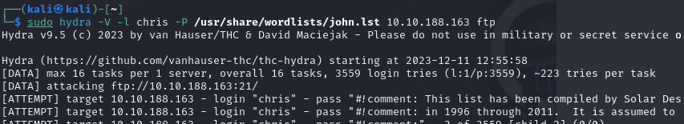
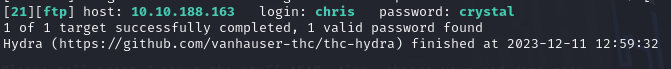
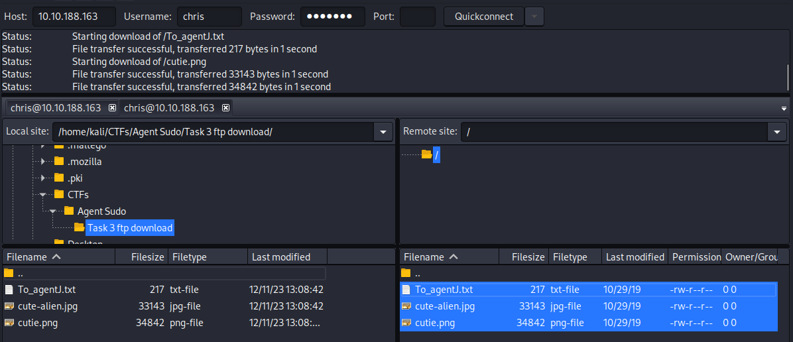
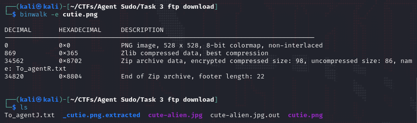
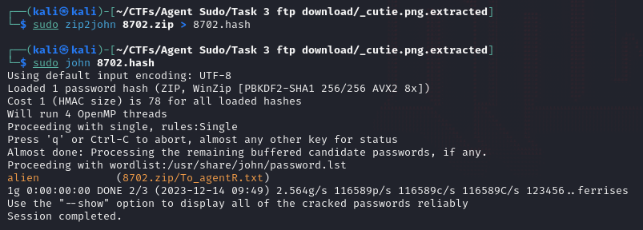

# Agent Sudo

---

Machine by [DesKel](https://tryhackme.com/p/DesKel)

Tryhackme [link](https://tryhackme.com/room/agentsudoctf)

---

Tools Used:
* Kali Linux
* NMAP
* CURL
* hydra
* filezilla (or any other ftp client)
* binwalk
* zip2john
* John the Ripper
* stegcracker

---
1. nmap scan

    Enumerate the machine and get all the important information

    `nmap -A VICTIM_IP`

    

    We can see 3 open ports.

    If we visit the web page of the machine we can see the next message:
   
    
    
    Due to the machine name and the end of the message I tried to change the user agent to use the alphabet with curl:

    `curl -U "R" -L VICTIM_IP`
     
    With the user agent as "R" this is what we see, knowing that there are 25 agents, plus the boss, wich is "R"

    
    
    I then tried to change the user agent to, "A", then "B" and finally "C" and found this:
   
    
 
    Knowing that the user is "chris" with a weak password I then tried to use hydra with the john.lst dicctionary:

   

    And found that the password is "crystal"
   
   

    Then logged in with filezilla using "chris" and "crystal":

   
    
    Then downloaded all the files
   
    If we cat the content of file "To_agentJ.txt" we see:
   
    

    With this message we can deduce that one or more of the pics downloaded contains more info, probably with steganography, for that binwalk can be useful.
 
    With binwalk on the two files we can see that "cute-alien.jpg" contains only a JPEG image and "cutie.png" contains, a PNG image, and ZIP files:
    
 
    * We want to know what's inside the zip file on the "cutie.png" photo, for that the first thing we'll do is extract the contents, we can see a new folder "_cutie.png.extracted":
    

    The folder contains a txt file (it's empty) and a zip file, as it's password locked, we'll use the tool "zip2john" to extract a hash and then get it into a file we'll call "8702.hash"
    
 
    * To get the steg password we will use the tool "stegcracker" on the image "cute-alien.jpg".
    

    Until we finally get the password "Area51":
    
 

