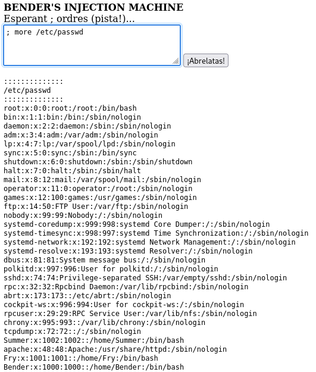
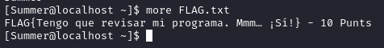

# So Simple 1

---

## Table of Content

1. [NMAP scan]()

---

### 1. NMAP scan

Escanejarem la màquina per veure quins serveis están corrent.

Ja a que hem vist un servei web utilitzaré dirb per mirar de buscar que hi ha, ens resalta la carpeta `/passwords/`.

### 2. Visitar http
    
Podem veure que dintre de `/passwords` trobem l'arxiu `FLAG.txt` i `passwords.html`:

### 3. FLAG 1

Dintre de `FLAG.txt` veiem la primera flag:

i dintre de `passwords.html` on no veiem res, pero si inspiccionem l'arxiu podem veure que hi ha una contrasenya oculta:

### 4. ftp

Primer de tot probarém a utilitzar l'ftp en mode anonim:

Podem veure que hem trobat un altre flag, i una carpta `pub` que està buida:

Aqui podem veure una altra de les flags:

### 5. Cockpit web service

Només entrar a l'adreça al port `9090` veiem una altra flag:

### 6. Servei desconegut p. 13337

Visitant l'ip al port `13337` podem veure un altra flag:

### 7. robots.txt

Tornant a mirar l'escaneig de dirb, podemm veure un robots.txt, aquest arxiu s'utilitza per indicar a web-crawlers quins directoris i/o arxius no poden accedir

Podem veure un directori `/cgi-bin/` al que no tením accés, pero sí a dos arxius:

* `root_shell.cgi`

    Aquest és el contingut de l'arxiu, no pareix massa util, així que almenys de moment el deixarem de vanda.

    

 

* `injection.cgi`

    En aquest arxiu podem veure un formulari, amb el text `Esperant ; ordres (pista!...)` si utilitzem un punt i coma podem executar comandes i que ens ho retorni: 

    

    Per exemple amb la comanda `whoami`

    

    Intentem utilitzar `cat` per veure els continguts de `/etc/passwd` pero pareix que han canviat el programa de cat per que només imprimeix-qui un gat en ASCII:

    

    Pel que utilitzarém `more`, podem veure un usuari `Summer`, que si mirem al comentari de l'arxiu `/passwords/passwords.html` podria estar rel·lacionat amb la contrasenya "winter", també podem veure usuaris com "Bender" i "Fry":

    

### 8. Login SSH

Podem iniciar sessió SSH amb l'usuari "Summer" i contrasenya "winter" al port 22222:

Aqui trobem una altra Flag:

### 9. Homes d'altres usuaris

* Home de BENDER:

    Entrant a la home de "Bender" podem veure una carpeta de `/home/Bender/BENDER_SAFE` podem veure un missatge xifrat en gpg, de moment no tenim la clau per deixifrar-lo.

    

    Podem intentar usar gpg2john per intentar deixifrar la contrasenya de l'arxiu, primer el passaré a la màquina kali d'atac amb scp:

    

    I després utilitzaré gpg2john per extraure el hash de l'arxiu gpg i després passar-lo per john the ripper:

    
    
 

* Home de FRY:

    Dintre de la home de "FRY" podem veure veure una jpg `Safe_Password.jpg` i `journal.zip`

    

    Descarregarém els arxius amb scp:

    

    Podem veure que l'imatge jpg no conté res d'important, pel que revisarem que no tingui res amagat amb esteganografia

    

    Amb l'eina `binwalk` comprovem el contingut de l'imatge, podem veure que no hi ha res:

    

    Després comprovarém el contingut de l'arxiu zip, veiem que està bloquejat amb una contrasenya:
    
    

    Després utilitzarem "zip2john" per intentar atacar la contrasenya:

    

     amb John The Ripper

  
---

Llistat de Flags:

* Lloc web /passwords/FLAG.txt 
  
  `FLAG{¡Maldito abrelatas!¡Mataste a mi padre y ahora has venido a por mí!} - 10 Punts`

* FTP (mode anonim)
 
  `FLAG{Besa mi brillante trasero metálico.} - 10 Punts`

* Cockpit Services 
  
  `FLAG {OH DIOS Mío, ELLA ESTÁ ATRAPADA EN UN BUCLE INFINITO DE REPETICIÓN... iY FRY ES IDIOTA!} - 10 PUNTS`

* Port 13337 
  
  `FLAG{Han Encont radoMiBac kDoo rBender} - 10Punts`

* User Summer 
  
  `FLAG{Tengo que revisar mi programa. Mmm... ¡Sí!} - 10 Punts`

* 