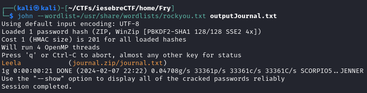
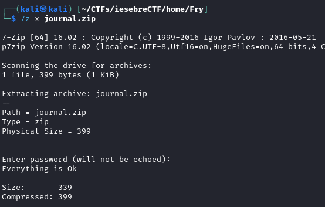
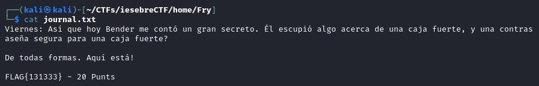
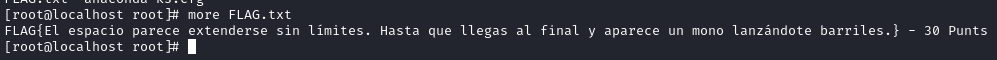
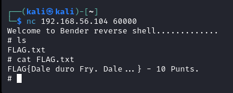

# INSEbreCTF

## Taula de continguts

1. [NMAP scan](https://github.com/R3TR0R0C4/CTFs/blob/main/Insti/INSEbreCTF/INSEbreCTF.md#1-nmap-scan)
2. [Visitar http](https://github.com/R3TR0R0C4/CTFs/blob/main/Insti/INSEbreCTF/INSEbreCTF.md#2-visitar-http)
3. [FLAG 1](https://github.com/R3TR0R0C4/CTFs/blob/main/Insti/INSEbreCTF/INSEbreCTF.md#3-flag-1)
4. [ftp](https://github.com/R3TR0R0C4/CTFs/blob/main/Insti/INSEbreCTF/INSEbreCTF.md#4-ftp)
5. [Cockpit web service](https://github.com/R3TR0R0C4/CTFs/blob/main/Insti/INSEbreCTF/INSEbreCTF.md#5-cockpit-web-service)
6. [Servei desconegut p. 13337](https://github.com/R3TR0R0C4/CTFs/blob/main/Insti/INSEbreCTF/INSEbreCTF.md#6-servei-desconegut-p-13337)
7. [robots.txt](https://github.com/R3TR0R0C4/CTFs/blob/main/Insti/INSEbreCTF/INSEbreCTF.md#7-robotstxt)
8. [Login SSH](https://github.com/R3TR0R0C4/CTFs/blob/main/Insti/INSEbreCTF/INSEbreCTF.md#8-login-ssh)
9. [Homes d'altres usuaris](https://github.com/R3TR0R0C4/CTFs/blob/main/Insti/INSEbreCTF/INSEbreCTF.md#9-homes-daltres-usuaris)
10. [Escalada de privilegis](https://github.com/R3TR0R0C4/CTFs/blob/main/Insti/INSEbreCTF/INSEbreCTF.md#10-escalada-de-privilegis)
11. [Flag usuari root](https://github.com/R3TR0R0C4/CTFs/blob/main/Insti/INSEbreCTF/INSEbreCTF.md#11-flag-usuari-root)
12. [Flag port 60000](https://github.com/R3TR0R0C4/CTFs/blob/main/Insti/INSEbreCTF/INSEbreCTF.md#12-flag-port-60000)
13. [Missatge GPG](https://github.com/R3TR0R0C4/CTFs/blob/main/Insti/INSEbreCTF/INSEbreCTF.md#13-missatge-gpg)
14. [Llista de Flags](https://github.com/R3TR0R0C4/CTFs/blob/main/Insti/INSEbreCTF/INSEbreCTF.md#llistat-de-Flags)

---

Eines Utilitzades:

- Kali Linux
- NMAP
- client FTP
- binwalk
- zip2john
- 7zip
- gcc
- ssh
- nc / ncat

---

### 1. NMAP scan

Escanejarem la màquina per veure quins serveis están corrent.

Ja a que hem vist un servei web utilitzaré dirb per mirar de buscar que hi ha, ens resalta la carpeta `/passwords/`.

### 2. Visitar http

Podem veure que dintre de `/passwords` trobem l'arxiu `FLAG.txt` i `passwords.html`:

### 3. FLAG 1

Dintre de `FLAG.txt` veiem la primera flag:

i dintre de `passwords.html` on no veiem res, pero si inspiccionem l'arxiu podem veure que hi ha una contrasenya oculta:

### 4. ftp

Primer de tot probarém a utilitzar l'ftp en mode anonim:

Podem veure que hem trobat un altre flag, i una carpta `pub` que està buida:

Aqui podem veure una altra de les flags:

### 5. Cockpit web service

Només entrar a l'adreça al port `9090` veiem una altra flag:

### 6. Servei desconegut p. 13337

Visitant l'ip al port `13337` podem veure un altra flag:

### 7. robots.txt

Tornant a mirar l'escaneig de dirb, podemm veure un robots.txt, aquest arxiu s'utilitza per indicar a web-crawlers quins directoris i/o arxius no poden accedir

Podem veure un directori `/cgi-bin/` al que no tením accés, pero sí a dos arxius:

- `root_shell.cgi`

  Aquest és el contingut de l'arxiu, no pareix massa util, així que almenys de moment el deixarem de vanda.

  

 

- `injection.cgi`

  En aquest arxiu podem veure un formulari, amb el text `Esperant ; ordres (pista!...)` si utilitzem un punt i coma podem executar comandes i que ens ho retorni:

  

  Per exemple amb la comanda `whoami`

  

  Intentem utilitzar `cat` per veure els continguts de `/etc/passwd` pero pareix que han canviat el programa de cat per que només imprimeix-qui un gat en ASCII:

  

  Pel que utilitzarém `more`, podem veure un usuari `Summer`, que si mirem al comentari de l'arxiu `/passwords/passwords.html` podria estar rel·lacionat amb la contrasenya "winter", també podem veure usuaris com "Bender" i "Fry":

  

### 8. Login SSH

Podem iniciar sessió SSH amb l'usuari "Summer" i contrasenya "winter" al port 22222:

Aqui trobem una altra Flag:

### 9. Homes d'altres usuaris

- Home de BENDER:

  Entrant a la home de "Bender" podem veure una carpeta de `/home/Bender/BENDER_SAFE` podem veure un missatge xifrat en gpg, de moment no tenim la clau per deixifrar-lo.

  

  De moment el deixaré de banda, podem veure la resolució a [Apartat 13](/INSEbreCTF.md#13-missatge-gpg)

 

- Home de FRY:

  Dintre de la home de "FRY" podem veure veure una jpg `Safe_Password.jpg` i `journal.zip`

  

  Descarregarém els arxius amb scp:

  

  Podem veure que l'imatge jpg no conté res d'important, pel que revisarem que no tingui res amagat amb esteganografia

  

  Amb l'eina `binwalk` comprovem el contingut de l'imatge, podem veure que no hi ha res:

  

  Després comprovarém el contingut de l'arxiu zip, veiem que està bloquejat amb una contrasenya:

  

  Utilitzarem "zip2john" per intentar atacar la contrasenya amb un atac de diccionari:

  

  Amb john the ripper podrém treure la contrasenya d'aquest arxiu:

  

  Amb 7z extreurel i veure el contingut, una altra flag!

  

  

### 10. Escalada de privilegis

Aprofitant que tenim un accés d'ssh amb l'usuar `Summer` he intentat buscar una escalada de privilegis.

Primer de tot necessitem saber en quina versió estem treballant

Amb un `more /etc/fedora-release` veiem que estem treballant amb fedora 26

I amb un `uname -a` veiem que la versió del kernel és la `4.11.8-300`

Apartir d'aquesta informació podem buscar un exploit, aquest és el que he trobat: [link](https://vulners.com/zdt/1337DAY-ID-30705)

Amb gcc el compilaré i l'enviaré a la màquina:

Una vegada enviat entrem amb Summer i iniciem l'exploit, veurem que ara sóm l'usuari root:

### 11. Flag usuari root

Navegant cap a la home del root podem veure una altra FLAG:

Aquesta és la FLAG

### 12. Flag port 60000

Amb l'accés de root podem aprofitar per utilitzar lsof per veure quins ports están escoltant i a quins processos estàn relacionats.

Podem veure que el port 60000 està rel·lacionat amb nc, podem utilitzar nc o ncat per intentar connectar-nos.

Podem veure una altra FLAG:

### 13. Missatge GPG

Amb els nous permissos de root podem veure un historial de la shell de l'usuari root amb more, i podem veure una linia on s'executa una comanda `./safe 131333`

Provem a usar el codi a l'arxiu gpg, i podem veure que el deixifrem:

Podem veure una altra flag i 3 pistes per una contrasenya (probablement per l'arxiu `journal.zip`)

---

### Llistat de Flags

- Lloc web /passwords/FLAG.txt

  `FLAG{¡Maldito abrelatas!¡Mataste a mi padre y ahora has venido a por mí!} - 10 Punts`

- FTP (mode anonim)

  `FLAG{Besa mi brillante trasero metálico.} - 10 Punts`

- Cockpit Services

  `FLAG {Oh Dios mío, ella está atrapada en un bucle infinito de repetición... ¡Y Fry es idiota!} - 10 Punts`

- Port 13337

  `FLAG{HanEncontradoMiBackDoorBender} - 10 Punts`

- User Summer

  `FLAG{Tengo que revisar mi programa. Mmm... ¡Sí!} - 10 Punts`

- Home root

  `FLAG{El espacio parece extenderse sin límites. Hasta que llegas al final y aparece un mono lanzándote barriles.} - 30 Punts`

- ncat port 60000

  `FLAG{Dale duro Fry. Dale...} - 10 Punts.`

- Missatge GPG

  `FLAG{Y allaaaaaa vamoooooooos} - 20 Punts`

- journal.zip

  `FLAG{131333} - 20 Punts`
