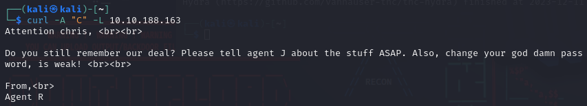

# Agent Sudo

---

Machine by [DesKel](https://tryhackme.com/p/DesKel)

Tryhackme [link](https://tryhackme.com/room/agentsudoctf)

---

Tools Used:

- Kali Linux
- NMAP
- CURL
- hydra
- filezilla (or any other ftp client)
- binwalk
- zip2john
- John the Ripper
- stegcracker
- steghide

---

### 1. nmap scan

Enumerate the machine and get all the important information.

By using the next command:

`nmap -A VICTIM_IP`

We can see 3 open ports

Visiting the website we can see the next message:

### 2. Changing user agent

Due to the machine name and the end of the message I tried to change the user agent to use the alphabet with curl:

`curl -U "R" -L VICTIM_IP`

With the user agent as "R" this is what we see, knowing that there are 25 agents, plus the boss, wich is "R"

I then tried to change the user agent to, "A", then "B" and finally "C" and found this:

### 3. Hydra ftp brute force

Knowing that the user is "chris" with a weak password I then tried to use hydra with the john.lst dicctionary:

And found that the password is "crystal":

Then logged into the ftp server using "chris" and "crystal":

Then downloaded all the files

### 4. Steganography

If we cat the content of file "To_agentJ.txt" we see:

With this message we can deduce that one or more of the pics downloaded contains more info, probably with steganography, for that binwalk can be useful.

With binwalk on the two files we can see that "cute-alien.jpg" contains only a JPEG image and "cutie.png" contains, a PNG image, and ZIP files:

- We want to know what's inside the zip file on the "cutie.png" photo, for that the first thing we'll do is extract the contents, we can see a new folder "_cutie.png.extracted":

    

    The folder contains a txt file (it's empty) and a zip file, as it's password locked, we'll use the tool "zip2john" to extract a hash and then get it into a file we'll call "8702.hash", then using john the ripper we can get the original password, wich is "alien":

    

- To get the steg password we will use the tool "stegcracker" on the image "cute-alien.jpg".

    

Until we finally get the password "Area51":

Then we will extract the zip file with the obtained password, now the file "To_agentR.txt" is completed and can be read:

Then, with the "Area51" password we can use the tool "steghide" to extract the contents of the file "cute-alien.jpg" (we can only do this on .jpg files, as .png files are unsupported)

### 5. SSH login

As we can see there's a username mentioned "james" and it's password "hackerrules!"

We can now try to login with ssh through this user:

And we get the user flag on the user's home:

### 6. Autopsy image reverse search

Then we can get the "Alien_autopsy.jpg" to investigate further, for that i'll use scp:

Binwalk doesn't show anything out of the ordinary, there is some exif data, but it isn't useful.

A google images reverse search doesn't show anything, with tineye and the clue of fox news, i've found a website and the case:

### 7. Privilege escalation

I've tried to look for the linux kernel exploits, but couldn't find anything useful, so, with "sudo -l" we can find what privileges we have, we habe access to "/bin/bash", and with a google search of "exploit /bin/bash" we find this:

Then put the code into a .py file and execute it, then input the current user and password:

### 8. Root flag

Then we can cd into our root's home, cat the root.txt and get the root flag, and the Agent R name "DesKel".

