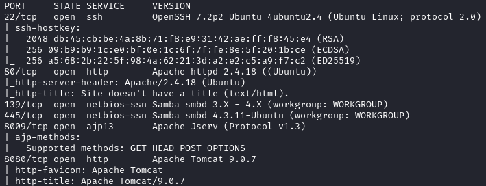
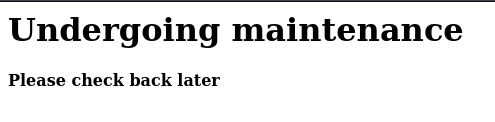
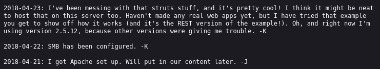
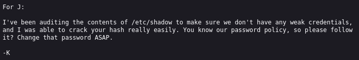
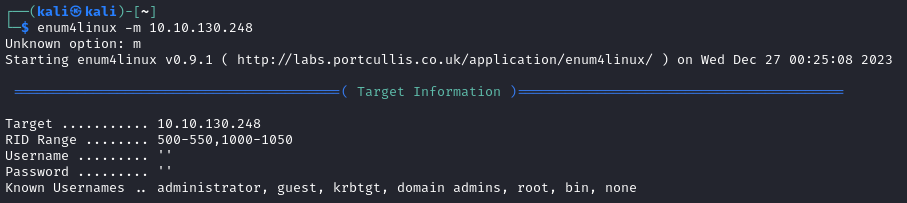
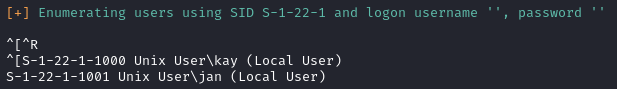
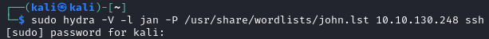

# Basic Pentesting

---

Machine by [ashu](https://tryhackme.com/p/ashu)

Tryhackme [link](https://tryhackme.com/room/basicpentestingjt)

---

Tools Used:

- Kali Linux
- NMAP
- dirb

---
1.  Nmap Scan
    We'll use an intense scan of nmap on the victim ip to get the current services:
    
    

    This is the default page that we can see:

    

2. dirb ennumeration

    Following the clue of the hidden service on the machine, and also that there is nothing on the first page of the machine i'll use dirb to see what i can find:

    The options i'll use are:
    `dirb http://VICTIM_IP/ -w /usr/share/wordlists/dirbuster/directory-list-1.0.txt`

    We can see that we've found a `/development/` folder:
    
   
    Visiting this folder we can see two files `dev.txt` and `j.txt`

    This is the content of dev.txt:

    

    And this is the contents of j.txt

    

    With this we can extract that the machine is susceptible to a brute force attack and one of the user's username probably starts with a J.

3. SMB enumeration

    With enum4linux we can enumerate the contents and guess the users off of a smb share, simply by indicating the target machine:
    `enum4linux -m VICTIM_IP`

    
    
    After some time we'll see that we've found the user `kay` and user `jan`:

    

4. SSH Bruteforce

    Using hydra i'll attempt a bruteforce attack on the ssh service with the user `jan` as kay has indicated it has a weak password:

    

    After some time i've found the password:

    
