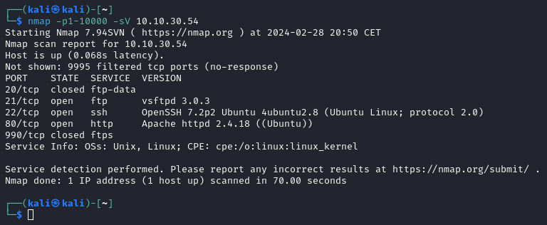
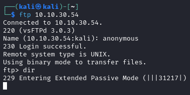
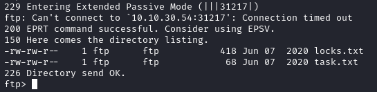

# RootMe

---

Machine by [Sevuhl](https://tryhackme.com/p/Sevuhl)

Tryhackme [link](https://tryhackme.com/room/cowboyhacker)

---

Tools Used:

- Kali Linux
- NMAP

---

1.  Nmap Scan
    Doing a full nmap was taking too long, so i'll limit it to the first 10.000 ports, this is the result

    

    Visiting the website we can't really see anything useful.

2.  anonymous ftp
   
    Trying to login as anonymous is successful, but trying to list the directory we get a message:

    `229 Entering Extended Passive Mode (|||9521|)`

    

    After a while we get an error of a connection time out, and we get the result of the command:

    

    We can see 2 files `locks.txt` and `task.txt`, we'll download them and see what's inside.

3.  locks and task

    The file `locks.txt` contains what seems to be some passwords.

    
        
    And the file `task.txt` a couple of tasks and a name:

    
    
    

4.  Hydra
   
    After getting what looks like some passwords, i'll be using hydra to try and breake my way in through SSH.

    For that i'll be needing a dicctionary with usernames, since i don't know wich one it is, to make it i'll be using all the names i've found on the website, both starting with uppercase and lowercase, and the username `lin` that i've found on the `task.txt` file:

    This will be the resulting dictionary:

    

    And this the hydra command:

    

    As we can see the password for `lin` is ``.

5.  SSH login and first flag

    After getting the password for the user lin, we can see on the Desktop the file `user.txt`, that's the first flag:

    

6.  root flag

    After looking around the filesystem and not finding anythin i tried to use my sudo permissions on the root's home folder, but turns out I don't have the permissions to do that:

    

    Since i can't see what's inside the root folder, and probably contain the root's flag, i used `sudo -l` to see what i have permissions on, turns out that i can use the binary `tar`:

        

    Then i can attempt to compress the contents of the root folder:

    

    And decompress it:

    

    We can see that we found the root flag:

    
