# Simple CTF<!-- omit in toc -->

---

Machine by [MrSeth6797](https://tryhackme.com/p/MrSeth6797)

Tryhackme [link](https://tryhackme.com/r/room/easyctf)

---

## Table of Content<!-- omit in toc -->

- [1. Nmap Scan](#1-nmap-scan)
- [2. Dirb Scan](#2-dirb-scan)
- [3. CMS Made Simple Exploitation](#3-cms-made-simple-exploitation)
- [4. SSH login](#4-ssh-login)
- [5. User flag](#5-user-flag)
- [6. Privilege escalation](#6-privilege-escalation)
- [7. Root flag](#7-root-flag)

---

## Tools Used:<!-- omit in toc -->

- Kali Linux
- NMAP
- Dirb

---

### 1. Nmap Scan

Doing a nmap scan reveals a webserver, ftp server and ssh on port 2222:

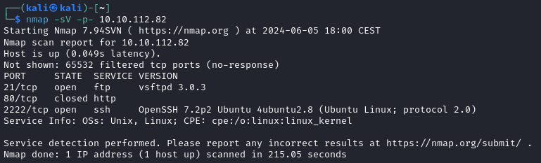

 

### 2. Dirb Scan

We can see a index, wich turns into a default apache installation page, a robots.txt with nothing interesting in it, and a "cms made simple" installation:

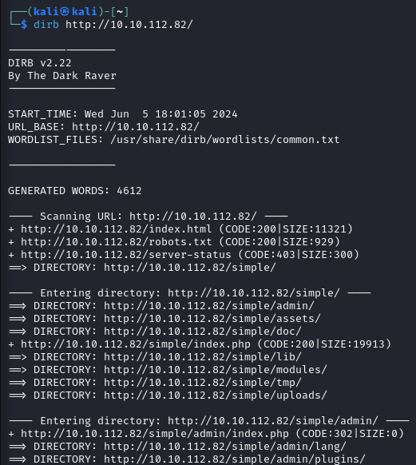

 

### 3. CMS Made Simple Exploitation

As we can see at the bottom of the page, the version of the Simple CMS is 2.2.8:

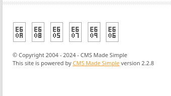

 

After googling `Simple CMS 2.2.8`, we can see this exploit on [exploit-db](https://www.exploit-db.com/exploits/46635):

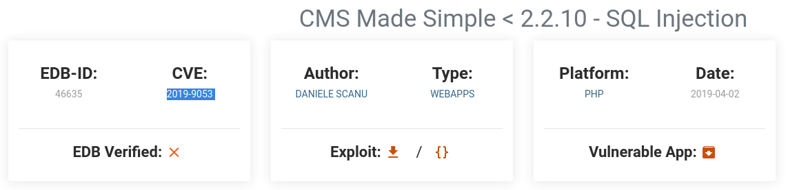

 

The exploit consists of a python script that we'll execute with the options `--url=http://Server-IP/simple/` and `--wordlist=/usr/share/wordlists/rockyou.txt`:

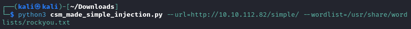

 

After executing it, this  is the result:

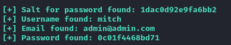

As we can see the provided username and password seems to not be correct:

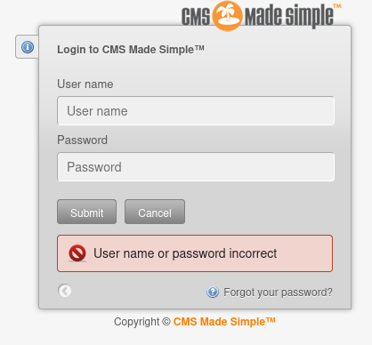

 

### 4. SSH login

I've tried to use hydra to get the ssh password with the previous username, as we can see we get a password, `secret`:

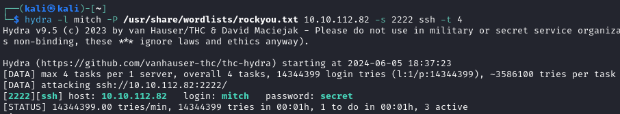

 

Let's try to login with ssh:

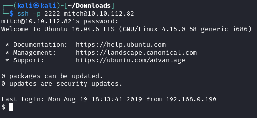

### 5. User flag

In the mitch home folder is the first flag:

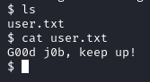

### 6. Privilege escalation

With `sudo -l` we'll check if there is any file or executable to wich we have root access without a password, as we can see we've got access to vim as root:

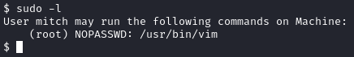

 

Let's execute vim with sudo:

 

And execute bash:

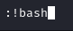

 

As we can see we're root:

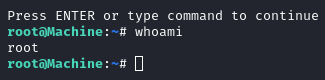

 

### 7. Root flag

Let's get the root's flag:

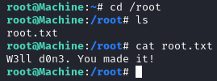
