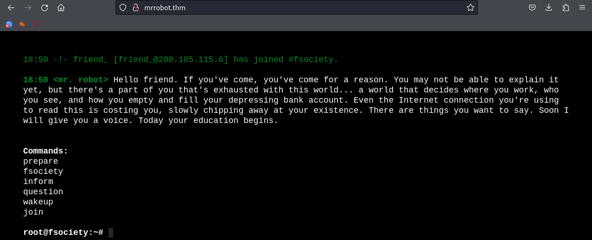
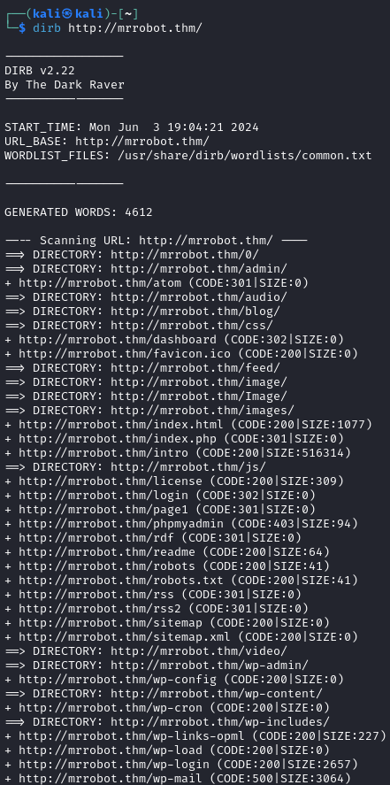
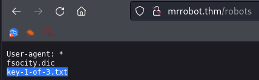
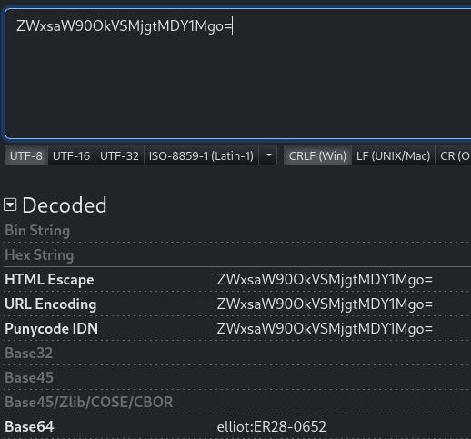

# Mr Robot CTF<!-- omit in toc -->

---

Machine by [DarkStar7471 ](https://tryhackme.com/p/ben )

Tryhackme [link](https://tryhackme.com/r/room/mrrobot)

---

## Table of Content<!-- omit in toc -->

- [1. Nmap Scan](#1-nmap-scan)
- [2. Dirb scan](#2-dirb-scan)
- [3. First flag](#3-first-flag)
- [4. Credentials](#4-credentials)
- [5. Wordpress access](#5-wordpress-access)
- [6. Reverse shell](#6-reverse-shell)
- [7. Second flag](#7-second-flag)
- [8. Privilege escalation](#8-privilege-escalation)

---

## Tools Used:<!-- omit in toc -->

- Kali Linux
- NMAP
- Dirb
- nc or ncat
- John the Ripper

---

### 1. Nmap Scan

Doing a nmap scan reveals a ssh service, wich is closed, and a web-server:

 

Visiting the website we see an intro video, and then a "shell" that gives some references to the series, nothing too useful at first sight:

 

### 2. Dirb scan

After a scan with Dirb, we can see the tipical `robots.txt` file:

 

### 3. First flag

After opening the robots.txt file there's an entry for `key-1-of-3.txt`:

After a scan with Dirb, we can see a `license` file, opening it shows some text, and after opening the inspect view, we can see our first flag:

 

### 4. Credentials

Visiting the `license` page in the webserver, and opening the inspect view, there is a hidden string:

 

After using an online decoder like [dencode](https://dencode.com), we see a username and password:

 

### 5. Wordpress access

Using the found credentials gets us into the wordpress admin page:

As user `elliot`, wich luckily is an administrator:

 

### 6. Reverse shell

As we have no access to the machine, i've installed a file explorer plugin:

 

With wich i've uploaded a php reverse-shell to the `wp-content/uploads/2024/06` folder:

 

Then set-up a nc listener, and visit the next url `http://mrrobot.thm/wp-content/uploads/2024/06/php-reverse-shell.php`

 

### 7. Second flag

After looking around the filesystem, in the robot's home folder we see a couple of files, `key-2-of-3.txt` wich we don't have permissions to open, and `password.raw-md5`:

 

This is the encripted password with MD5:

 

Wich we can crack with John the Ripper and the rockyou wordlist: `abcdefghijklmnopqrstuvwxyz`:

 

Now let's try to login as `robot` with the provided password, but first, since we're on a php reverse-shell i'll spawn a bash terminal with python, and then login:

 

And here we have the second flag:

 

### 8. Privilege escalation

I've tried using privilege escalation exploits, wich were unsuccessful, then I've tried to use SUID special permissions:

 

And nmap can be run in it's interactive mode as root:

 

Then I listed the contents of root's home, and found the last key:

