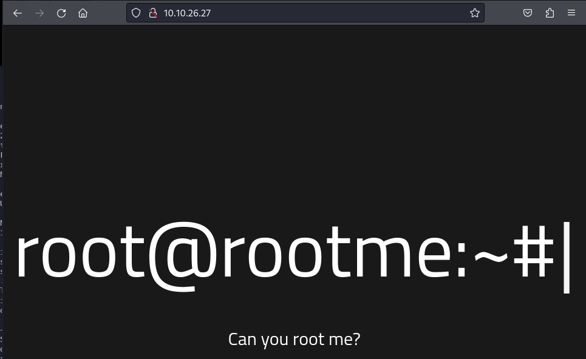

# RootMe

---

Machine by [ReddyyZ](https://tryhackme.com/p/ReddyyZ)

Tryhackme [link](https://tryhackme.com/room/rrootme)

---

Tools Used:
* Kali Linux
* NMAP

---

1. Nmap Scan

    Using `nmap -a IP` we will enumerate all the actie ports and versions of the machine.

    

    We can see that apache 2.4.29 is running on port 80 and ssh 7.6 on port 22.
    Visiting the web we can see that there is a rootme banner, but nothing useful.
 
2. Dirbuster
    Then with dirbusters or dirb we can see that there are more directories, this is the command we'll use to see what are some of the contents on the machine:

    `dirbuster dir -u http://VICTIM_IP -w /usr/wordlists/dirbuster/directory-list-1.0.txt`

    

    As we can see `/panel/`, `/uploads/`, there's a css/js directory. 
 
    Visiting the `/panel/` subdirectory we can see that it's a section to upload files:
    

    And visiting `/uploads` we can see the folder `uploads` contents: