# RootMe

---

Machine by [ReddyyZ](https://tryhackme.com/p/ReddyyZ)

Tryhackme [link](https://tryhackme.com/room/rrootme)

---

Tools Used:

- Kali Linux
- NMAP

---

1.  Nmap Scan

    Using `nmap -a IP` we will enumerate all the actie ports and versions ofthe machine.

    

    We can see that apache 2.4.29 is running on port 80 and ssh 7.6 on port22.
    Visiting the web we can see that there is a rootme banner, but nothinguseful.

    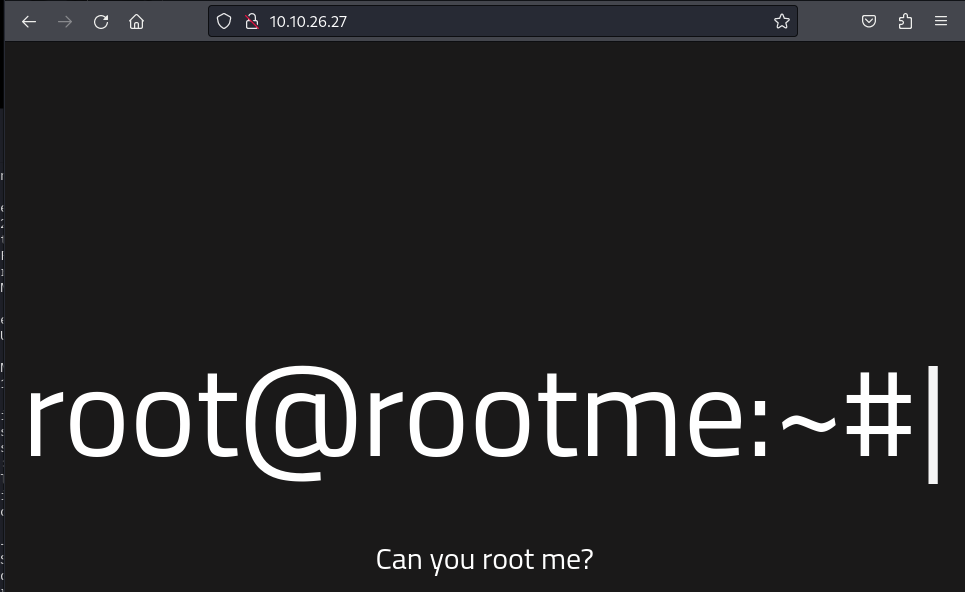

     

2.  Dirbuster
    Then with dirbusters or dirb we can see that there are more directories, this is the command we'll use to see what are some of the contents on the machine:

    `dirbuster dir -u http://VICTIM_IP -w /usr/wordlists/dirbusterdirectory-list-1.0.txt`

    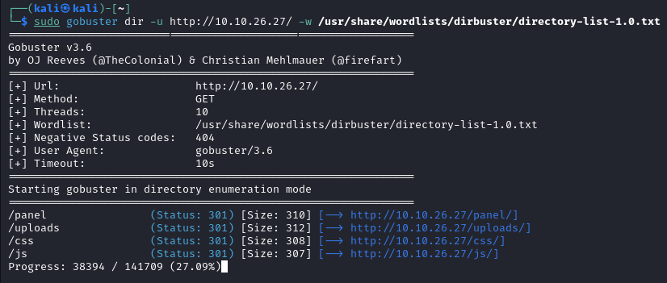

    As we can see `/panel/`, `/uploads/`, there's a css/js directory.

     
    Visiting the `/panel/` subdirectory we can see that it's a section toupload files:

    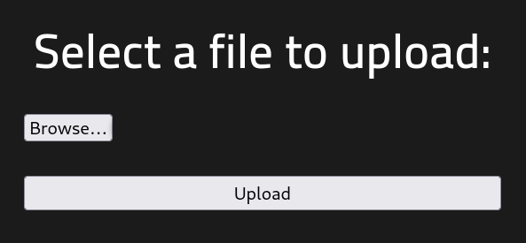

    And visiting `/uploads` we can see the folder `uploads` contents:

    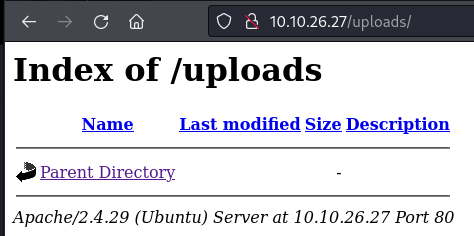

     

3.  Exploit Preparation
    When visiting the page source for the panel page i saw that it's running with php, for the exploit i'll use a built-in exploit in kali.
    The exploit in queston is situated in `/usr/share/webshells/php` and it's `php-reverse-shell.php` and i'll edit it with nano:

    

    The edits that need to be done are:

    - Change the `ip = ''` to our attack machine's ip
    - Optionally the port

        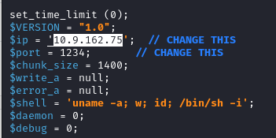

    Then i'll change the extension from `.php` to `.phtml`, as the website doesn't allow the upload of php files, but it still can upload and execute the phtml.

    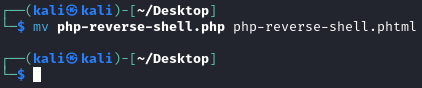

    Then I'll upload it to the portal:

    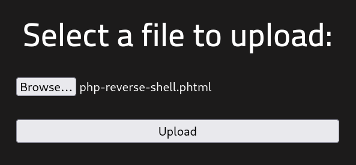

    Then we'll open up a ncat connection to the port we indicated previously on the exploit:

    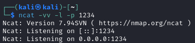

    Then visiting the Victim machine's IP followe by `/uploads/` we can see a new file:

    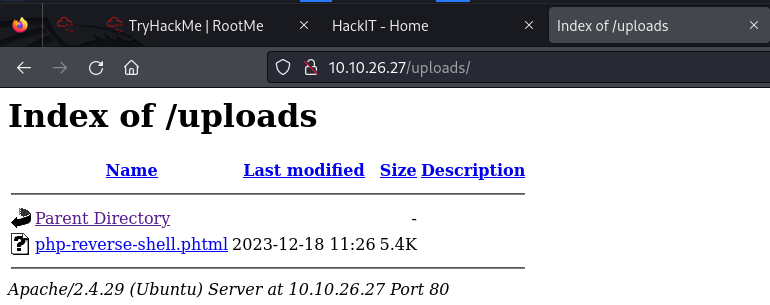

    Then by clicking it we get the next message on the web browser, we'll also receive the ncat connection:

    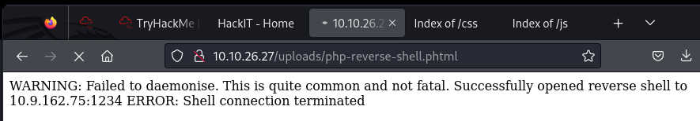

    As we can see we're logged-in as `www-data`:

    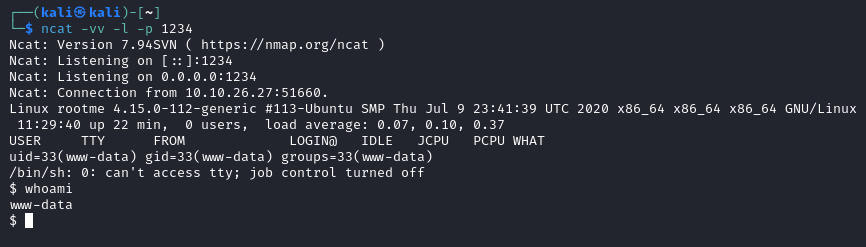
