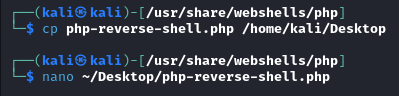
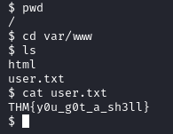
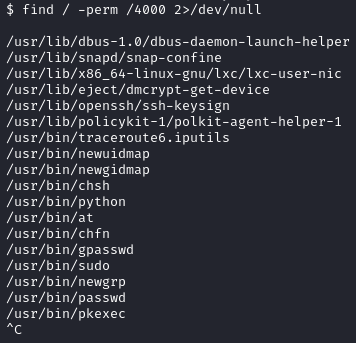
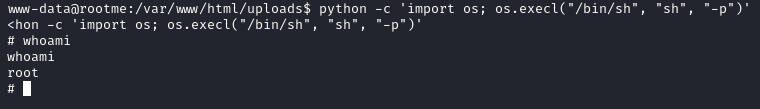
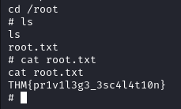

# RootMe

---

Machine by [ReddyyZ](https://tryhackme.com/p/ReddyyZ)

Tryhackme [link](https://tryhackme.com/room/rrootme)

---

Tools Used:

- Kali Linux
- NMAP
- gobuster
- any text editor
- ncat
- python (on the victim machine)

---

1.  Nmap Scan

    Using `nmap -a IP` we will enumerate all the actie ports and versions ofthe machine.

    

    We can see that apache 2.4.29 is running on port 80 and ssh 7.6 on port22.
    Visiting the web we can see that there is a rootme banner, but nothinguseful.

    

     

2.  Gobuster

    Then with gobuster or dirbuster we can see that there are more directories, this is the command we'll use to see what are some of the contents on the machine:

    `gobuster dir -u http://VICTIM_IP -w /usr/wordlists/dirbusterdirectory-list-1.0.txt`

    

    As we can see `/panel/`, `/uploads/`, there's a css/js directory.

     
    Visiting the `/panel/` subdirectory we can see that it's a section toupload files:

    

    And visiting `/uploads` we can see the folder `uploads` contents:

    

     

3.  Exploit Preparation

    When visiting the page source for the panel page i saw that it's running with php, for the exploit i'll use a built-in exploit in kali.
    The exploit in queston is situated in `/usr/share/webshells/php` and it's `php-reverse-shell.php` and i'll edit it with nano:

    

    The edits that need to be done are:

    - Change the `ip = ''` to our attack machine's ip
    - Optionally the port

        

4. Using the exploit

    Then i'll change the extension from `.php` to `.phtml`, as the website doesn't allow the upload of php files, but it still can upload and execute the phtml.

    

    Then I'll upload it to the portal:

    

    Then we'll open up a ncat connection to the port we indicated previously on the exploit:

    

    Then visiting the Victim machine's IP followe by `/uploads/` we can see a new file:

    

    Then by clicking it we get the next message on the web browser, we'll also receive the ncat connection:

    

    As we can see we're logged-in as `www-data`:

    

5. Getting the user flag

    In the `/var/www` there will be the user flag: 

    

6. Privilege escalation

    Then, by using the clue of the "Search for files with SUID permission, which file is weird?" i've used the command `find /`, it will search on the root of the system, `-perm /4000` we'll search for the specific permissions, and with `2>/dev/null` it won't return all the errors, and only show the files it has access to.
    
    This will be the resulting command:
    `find / -perm /4000`

    With this result:

    

    the `/usr/bin/python` is interesting, as we could use it to our advantage

    By using python we will be able to get a privilege escalation with the next command:
    `python -c 'import os; os.execl("/bin/sh", "sh", "-p")'`
    
    first of all we are calling python with the option `-c` to give it a command to execute, `import os;` will import the os library and give us access to `execl` wich in this case is used to replace the current process (python) with a new one (wich will be a shell like sh or bash) after giving python the path of the executable with `"/bin/sh"` (wich will be the shell to use) we'll give it an argument in this case `sh` (we'll replace it with whatever shell we want to use) with the flag `-p` we're indicating that we want a login shell, and thus giving us root access:

    

7. Getting the root flag

    We can finally get the root flag that's on the root's home:

    
