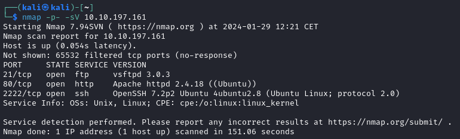
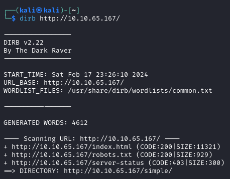
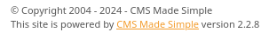

# Simple CTF

---

Machine by [MrSeth6797](https://tryhackme.com/p/MrSeth6797)

Tryhackme [link](https://tryhackme.com/room/easyctf)

---

Tools Used:

- Kali Linux
- NMAP
-

---

1.  Nmap Scan

    Using `nmap -sV -p- IP` we'll get all the ports of the machine along a small description of said ports:

    

2.  First looks

    By visiting the website on port 80 we can see that there's a web server with apparently nothing on it, let's try dirb to look for folders on said server:

    

    With it we can see the index from before, a robots.txt that doesn't contain anything relevant, and a server-status that's forbidden for us, but the `/simple/` folder has been found, wich, after visiting it, contains the "CMS Made Simple" CMS.

 

3. Looking for vulnerabilities

   At the bottom of the page we can see the version, `2.2.8`:

   

   After a quick search we come up with the [CVE-2019-9053](https://github.com/Mahamedm/CVE-2019-9053-Exploit-Python-3) vulnerability, wich we might be able to exploit.

 

4. SQL Exploit
